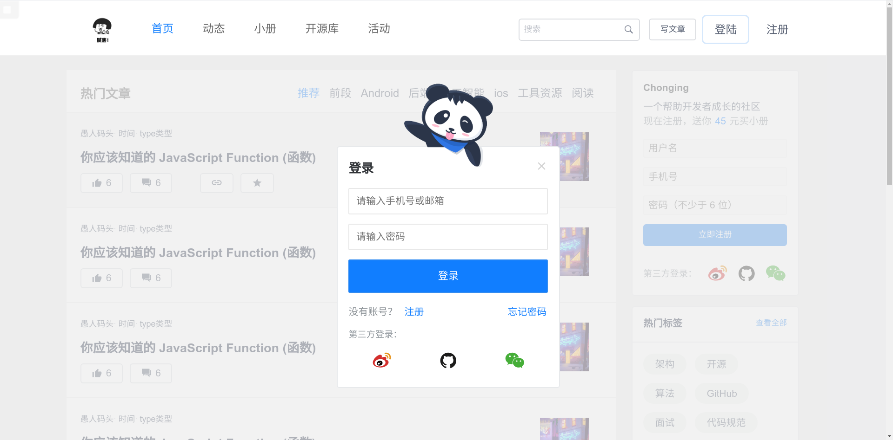
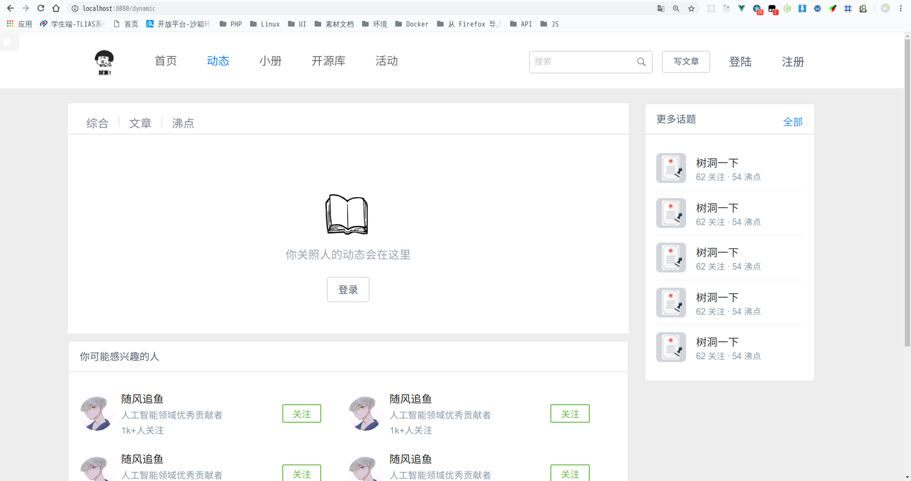
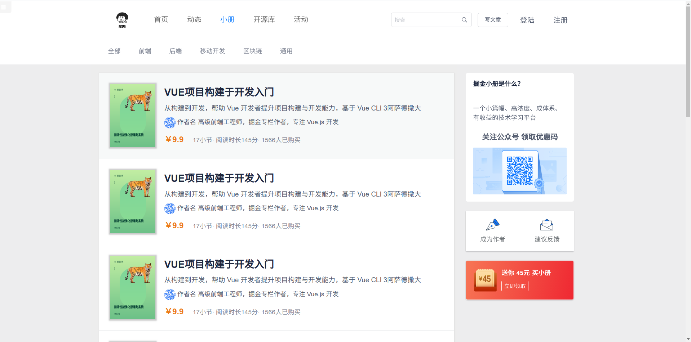
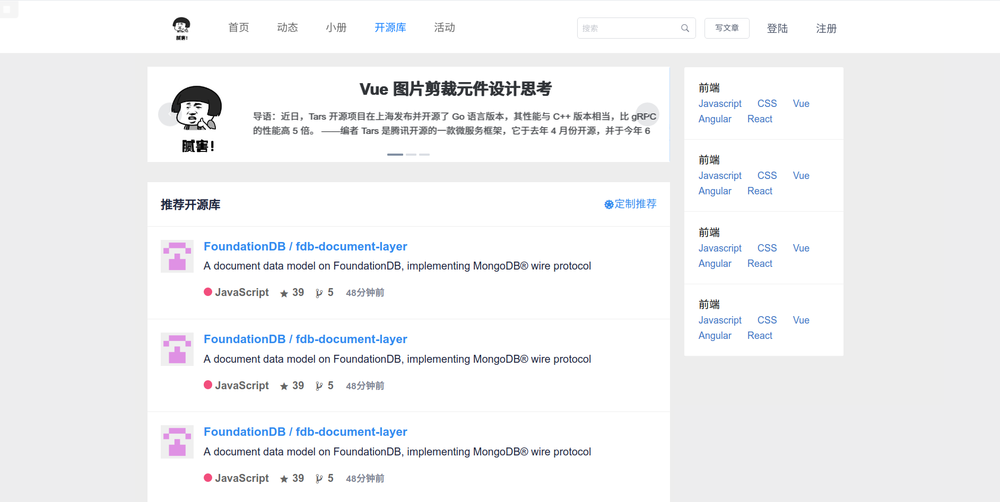
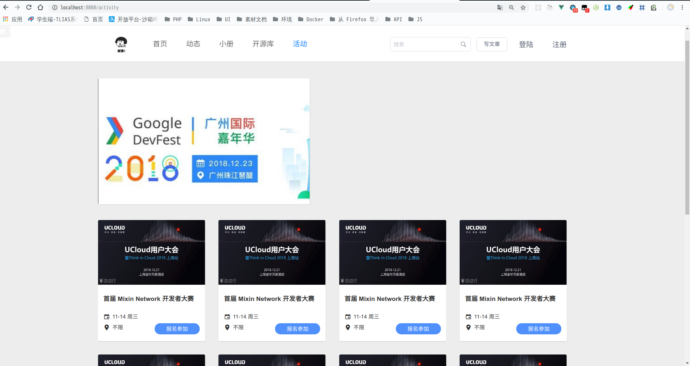

仿掘金（API接口）
前端地址： https://coding.net/u/yangzhuo2/p/chonging/git

api接口地址（之前的版本，如果打不开，请查看网速） https://documenter.getpostman.com/view/5960437/Rzn6uNG7#1a7d50df-1aa0-47c9-a75e-ef9f3729dbb8

本次项目分为： 

	用户模块 

	文章模块

基本功能 :

	文章分类、文章标签、评论、收藏、点赞、个人资料、消息通知、关注、搜索引擎、七牛云储存....

使用技术：

	larave、redis、dingoapi、jwt、transformer、elasticserach

环境搭建：

​	laradock(docker、nginx、phpfpm、mysql、redis、elasticsearch)
<<<<<<< HEAD

=======
>>>>>>> 9da0646caecf0c4cb127e6db5ebfbedd2f977128
